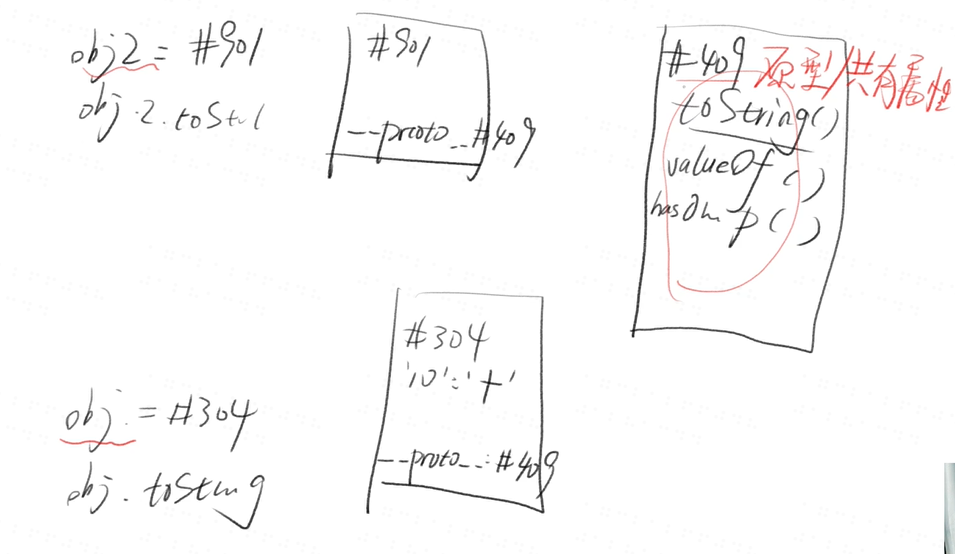
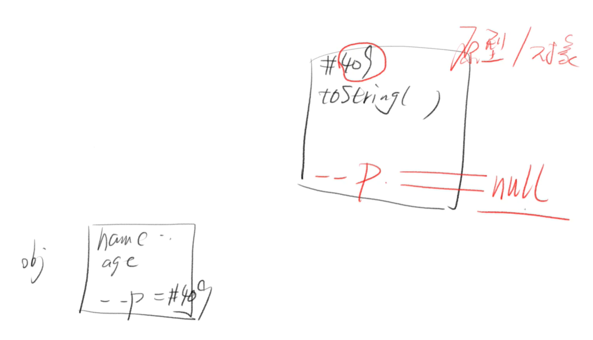
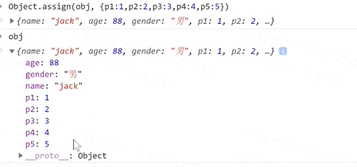
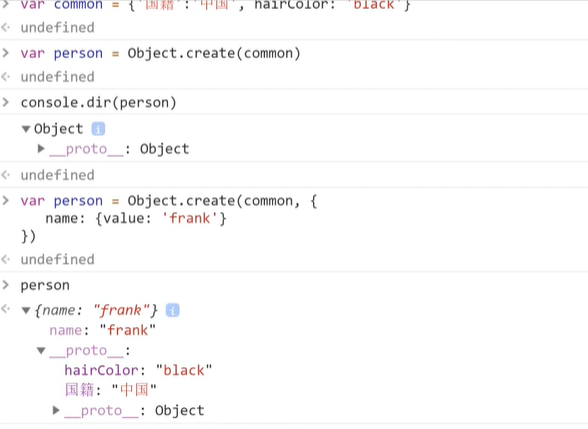
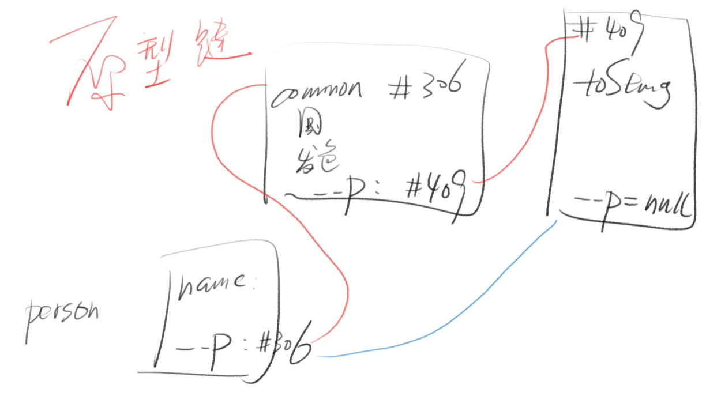
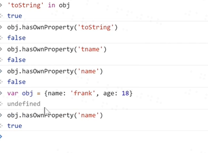

# js对象
## 定义
无序的数据集合
键值对的集合
## 写法
```
let obj = { 'name': 'frank', 'age': 18 } 简写
let obj = new Object({'name': 'frank'})  规范
console.log({ 'name': 'frank, 'age': 18 })
```
## 细节
键名是字符串，不是标识符，可以包含任意字符
引号可省略，省略之后就只能写标识符
就算引号省略了，键名也还是字符串（重要）


**所有属性名会自动变成字符串**
```
let obj = {
  1: 'a',
  3.2: 'b',
  1e2: true,
  1e-2: true,
  .234: true,
  0xFF: true
};
Object.keys(obj)
=> ["1", "100", "255", "3.2", "0.01", "0.234"]
```
## 变量作属性名
```
let p1 = 'name'
let obj = { p1 : 'frank'} 这样写，属性名为 'p1'
let obj = { [p1] : 'frank' } 这样写，属性名为 'name'
```
### 对比
1. 不加 [ ] 的属性名会自动变成字符串
2. 加了 [ ] 则会当做变量求值
3. 值如果不是字符串，则会自动变成字符串 

## 对象的隐藏属性
**隐藏属性**
1. JS 中每一个对象都有一个隐藏属性
2. 这个隐藏属性储存着其共有属性组成的对象的地址
3. 这个共有属性组成的对象叫做原型
4. 也就是说，隐藏属性储存着原型的地址

```
代码示例
var obj = {}
obj.toString() // 居然不报错
因为 obj 的隐藏属性对应的对象上有 toString()
```



## 删除属性
1. delete obj.xxx 或 delete obj['xxx']
即可删除 obj 的 xxx 属性
**请区分「属性值为 undefined」和「不含属性名」**
2. 不含属性名 
'xxx' in obj === false
3. 含有属性名，但是值为 undefined
'xxx' in obj && obj.xxx === undefined
4. 注意 obj.xxx === undefined
不能断定 'xxx' 是否为 obj 的属性**

## 查看所有属性（读属性）
1. 查看自身所有属性
Object.keys(obj)
2. 查看自身+共有属性
console.dir(obj)
或者自己依次用 Object.keys 打印出 obj.__proto__
3. 判断一个属性是自身的还是共有的
obj.hasOwnProperty('toString')
## 原型
**每个对象都有原型**
1. 原型里存着对象的共有属性
2. 比如 obj 的原型就是一个对象
3. obj.__proto__ 存着这个对象的地址
4. 这个对象里有 toString / constructor / valueOf 等属性

**对象的原型也是对象**
1. 所以对象的原型也有原型
2. obj = {} 的原型即为所有对象的原型
3. 这个原型包含所有对象的共有属性，是对象的根
4. 这个原型也有原型，是 null



## 查看属性
**两种方法查看属性**
1. 中括号语法：obj['key'] 
2. 点语法：obj.key
3. 坑新人语法：obj[key] // 变量 key 值一般不为 'key'


***推荐使用中括号的语法***
.png)
.png)
## 修改或增加属性（写属性）
**直接赋值**
```
let obj = {name: 'frank'} // name 是字符串
obj.name = 'frank' // name 是字符串
obj['name'] = 'frank' 
obj[name] = 'frank' // 错，因 name 值不确定
obj['na'+'me'] = 'frank'
let key = 'name'; obj[key] = 'frank'
let key = 'name'; obj.key = 'frank' // 错
因为 obj.key 等价于 obj['key']
```
**批量赋值**
```
Object.assign(obj, {age: 18, gender: 'man'})
```

## 修改或增加共有属性
**无法通过自身修改或增加共有属性**
```
let obj = {}, obj2 = {} // 共有 toString
obj.toString = 'xxx' 只会在改 obj 自身属性
obj2.toString 还是在原型上
```
**我偏要修改或增加原型上的属性**
```
obj.__proto__.toString = 'xxx' // 不推荐用 __proto__
Object.prototype.toString = 'xxx' 
一般来说，不要修改原型，会引起很多问题
```
## 修改隐藏属性
**不推荐使用 __proto__**
```
let obj = {name:'frank'}
let obj2 = {name: 'jack'}
let common = {kind: 'human'}
obj.__proto__ = common
obj2.__proto__ = common
```
**推荐使用 Object.create**
```
let obj = Object.create(common)
obj.name = 'frank'
let obj2 = Object.create(common)
obj2.name = 'jack'
规范大概的意思是，要改就一开始就改，别后来再改
```


## 'name' in obj和obj.hasOwnProperty('name') 的区别
* 'name' in obj 不能看是共有的还是自己的
* obj.hasOwnProperty('name') 可以看是自己的还是共有的




